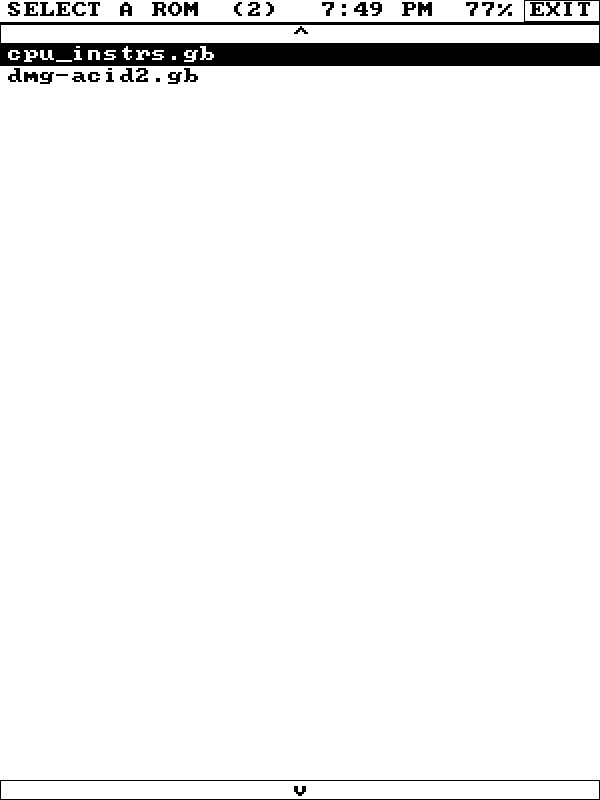
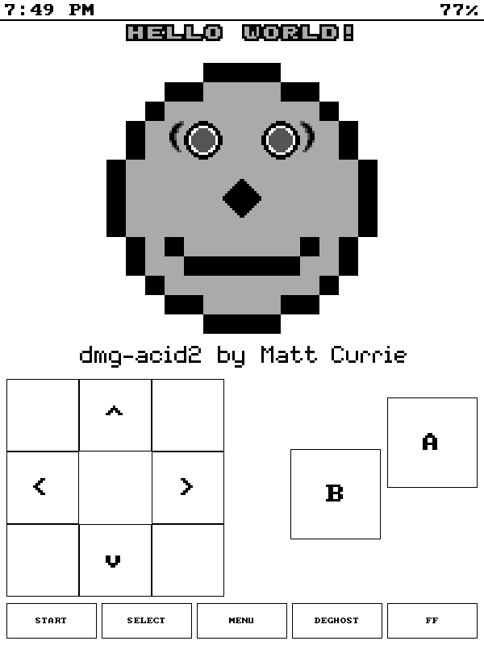
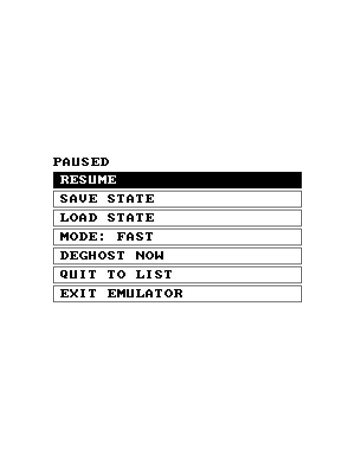

# KindleBoy

A Game Boy emulator for a jailbroken Kindle. It plays real `.gb` games on the
e-ink screen, lets you pick a game from a list right on the device, and draws
touch buttons on screen so you can actually play. It saves your battery saves
and has save states too.

Built for the **Kindle Basic, 10th/11th gen** (the cheap touch ones) running
KUAL. There's also a desktop build so you can develop and test it without
touching the Kindle.

A few things worth knowing up front:

- The emulator itself is [Peanut-GB](https://github.com/deltabeard/Peanut-GB), a
  tiny, rock-solid Game Boy core that people already run on microcontrollers.
  Its output is 4 shades of gray, which is exactly what e-ink wants.
- The screen is driven through [FBInk](https://github.com/NiLuJe/FBInk), which
  hides all the messy per-model differences in how Kindle e-ink panels refresh.
- E-ink is slow, so the trick is: run the emulator at full 60fps internally, but
  only *push pixels to the screen* about 8 times a second, using the fast "A2"
  refresh mode with a dither so motion stays crisp. When you stop and a screen
  sits still (a dialog box, a menu), it quietly upgrades to a clean 4-gray image.

This is GPL-3 (because FBInk is). No game ROMs are included. Bring your own.
See `LICENSE` and `NOTICE.md`.

<p align="center">
  
  
  
</p>

---

## Features

- Plays real Game Boy games (`.gb` files you own)
- Pick a game from a list on the Kindle, no file editing needed
- On-screen touch controls: D-pad, A, B, Start, Select, and a menu
- Battery saves work like the real cartridge, and won't corrupt if you unplug mid-write
- Save states to save and load anywhere in a game
- Resume drops you back exactly where you left off when you reopen a game
- Fast-forward button runs the game at 3x to skip slow text
- Fast mode for smooth motion, or a quality mode for a crisper picture
- Clock and battery level shown at the top of the screen
- A deghost button, plus automatic cleanup, to stop the e-ink smearing over time
- Auto-pauses after a few idle minutes to save battery
- Runs over the normal Kindle screen without touching your books or settings
- Settings live in a plain text file you can edit
- A max performance mode that pauses the Kindle system while you play
- One binary that runs on 10th and 11th gen Kindles

---

## Does it run on my Kindle?

**10th gen, firmware 5.17.1: yes.** The binary is built fully static, so it
doesn't care that 5.17.1 uses a hard-float userland: everything it needs is
baked into the one file, and it talks to the kernel the same way regardless.
That's the whole reason we build it static.

If for some reason it won't launch, the fallback is to rebuild with the
`kindlehf` toolchain instead of `kindlepw2` (one line in the Makefile). You
almost certainly won't need to.

The one thing that varies by firmware is whether `/mnt/us` is mounted "noexec"
(can't run binaries from it). Newer firmware does this. `run.sh` already handles
it by copying the binary to `/var/tmp` first, so you're covered either way.

---

## Getting started

1. Go to the [Releases page](https://github.com/itsParassharma/KindleBoy/releases)
   (every push is cross-compiled by GitHub Actions, so tagged releases always
   carry a ready-to-copy extension folder).
2. Download the zip for your firmware:
   - Firmware 5.16.3 or newer (e.g. a 10th-gen on 5.17.1) → **`kindleboy-kindlehf.zip`**
   - Older firmware, or if the hf build won't launch → `kindleboy-kindlepw2.zip`
3. Unzip it.
4. Drop the `kindleboy` folder into `extensions/` on the Kindle.
5. Put a `.gb` ROM in `roms/gb/` (it also checks the extension folder).
6. On the Kindle, launch **KUAL → KindleBoy → Play**.

---

## Playing

A clock and battery sit at the very top. The game is below that, and the
controls fill the bottom:

- Left: a D-pad. The corners work, so hold down-left to move diagonally.
- Right: A (top) and B (bottom), staggered like a real Game Boy.
- Bottom row: START, SELECT, MENU, DEGHOST, and FF (fast-forward).

Tap MENU to pause, where you can save or load a state, switch between Fast and
Quality display, clean up the screen, go back to the game list, or quit. You can
hold a direction and press A at the same time. Multi-touch works.

DEGHOST wipes any e-ink smearing straight away. FF runs the game at 3x, handy
for grinding through dialog. Your progress saves on its own (`game.sav` for the
in-game save, `game.st` for save states), and reopening a game resumes where you
stopped.

---

## When something's off

- **Nothing happens on launch?** Check `/mnt/us/kindleboy.log`: everything the
  program does gets logged there.
- **Won't run at all?** Probably the noexec thing. `run.sh` already copies to
  `/var/tmp`, but if it still won't go, try the **Play (max performance)** menu
  item, which frees up the device more aggressively.
- **Touch feels offset or mirrored?** The startup log prints the touch transform
  it picked up from FBInk plus the raw coordinate range. Grab those lines if you
  want to report it.
- **Ghosting / smearing over time?** Open and close the menu (that forces a full
  screen cleanup), or hit **Deghost Now**. If it bugs you, switch to QUALITY mode.
- **Feels sluggish?** FAST mode aims for ~11fps, which is close to what A2
  e-ink can do. For the smoothest play, use **Play (max performance)**: it
  pauses the whole Kindle system while you play and brings it back when you
  quit (takes about half a minute to come back, no reboot needed).

---

## How it's put together

```
core (runs anywhere)                 platform (pick one)
  emu       the Peanut-GB glue        kindle/   FBInk + touch + timing
  render    scaling + dithering       desktop/  an SDL2 window
  ui/browser/menu/overlay             sim/      fake, in-memory, for tests
  app       the state machine + the e-ink refresh scheduler
        \___________ platform.h (the one seam) ____________/
```

The core draws *every* pixel (game, menus, buttons) into a plain grayscale
buffer. The platform layer's only jobs are to show rectangles of that buffer and
to handle input. That's why the desktop build looks pixel-for-pixel identical to
the Kindle, and why almost everything could be built and tested without the
device.
